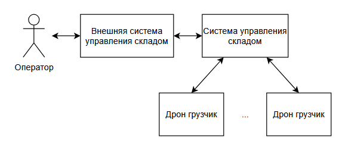

# Умный склад
## Краткое описание проектируемой системы
Рассматривается создание автоматизированной системы управления складом с мобильными роботами для транспортировки стеллажей с товаром (логистика типа «товар к человеку»).
## Ключевые ценности, ущербы, неприемлемые события
Ценность | Негативное событие | Оценка ущерба | Комментарий
--- | --- | --- | ---
Безопасность человека | Робот, движущийся со стеллажом, столкнулся с сотрудником на станции комплектации или в проходе, нанеся ему травму. | Критический | Приоритет № 1. Человек и роботы работают в одном пространстве.
Сохранность робота | Робот получил повреждения при столкновении с другим роботом или объектом инфраструктуры из-за чего вышел из строя и требует ремонта. | Высокий | Дорогостоящее оборудование, простой влияет на производительность склада.
Целостность инфраструктуры | Робот уронил стеллаж с грузом из-за ошибки позиционирования, неисправности захвата или столкновения. | Высокий | Прямые финансовые потери от порчи товара и инфраструктуры, простой склада.
Сохранность груза  | Система ошиблась: робот привез не тот стеллаж, или сотрудник положил товар не на тот стеллаж (из-за неверной подсказки системы). | Высокий | Нарушение учета, потеря товара, срыв отгрузки клиенту.
Непрерывность работы (производительность) | Из-за сбоя в управлении или коллизий маршрутов образовался "затор" роботов, и стеллаж не был доставлен вовремя. | Средний | Снижение скорости обработки запросов, простой сотрудников, возможные штрафы.
## Контекст
Система управляет флотом роботов, которые по команде из внешней системы управления складом (WMS) находят, поднимают и привозят нужный стеллаж с товаром на стационарную станцию комплектации. Оператор-человек взаимодействует с товаром на станции, после чего робот увозит стеллаж обратно в зону хранения.

## Базовый функциональный сценарий

## Высокоуровневая архитектура
### Описание подсистем
Название | Назначение
--- | ---
1\. Связь | Отвечает за защищенный обмен с внешней WMS (прием заданий привезти/убрать, отправка статусов). Также получает подтверждения от интерфейса оператора на станции.
2\. Система управления логикой склада (диспетчер) | Получает задачи, выбирает оптимального робота, прокладывает маршруты (избегая коллизий), назначает ячейки хранения. Координирует флот: отправляет на зарядку, блокирует зоны при работе человека. Ведет карту склада (где какой стеллаж стоит).
3\. Управление приводами роботов | Преобразует команды диспетчера в сигналы для моторов колес, подъемного механизма и захватов. Обеспечивает точное следование по QR-маршруту и позиционирование с заданной погрешностью.
4\. Система диагностики | Непрерывно получает данные: заряд батареи, показания лазерных дальномеров, камер (для сканирования QR-кодов), датчиков на захватах (проверка наличия стеллажа). При любой аномалии (препятствие, потеря QR-кода) передает сигнал в модуль управления логикой для остановки или изменения маршрута.
## Цели и предположения безопасности (ЦПБ)
### Цели безопасности
1. При любых обстоятельствах (включая сбои связи, ошибки ПО, отказы датчиков) роботы не должны сталкиваться друг с другом или со стеллажами.
2. При любых обстоятельствах стеллаж с грузом должен быть доставлен исключительно в ту секцию (ячейку), которая выделена ему системой управления логикой склада в момент выполнения задачи. 
3. При любых обстоятельствах недопустима установка стеллажа в произвольное или в неподтверждённое системой управления логикой место.
### Предположения безопасности
1. Физическая безопасность периметра склада (от проникновения посторонних) обеспечивается другими системами.
2. Устойчивость стеллажей и правильность укладки грузов на них находится в зоне ответственности других служб.
3. Система напольной навигации (QR-коды) поддерживается в чистоте и исправности обслуживающим персоналом.
4. Персонал склада благонадёжен.
