# Дрон-грузчик умного склада
## Краткое описание проектируемой системы
Рассматривается создание дрона-грузчика для автоматизированной системы управления складом с мобильными роботами для транспортировки стеллажей с товаром (логистика типа «товар к человеку»).
### Ключевые ценности, ущербы, неприемлемые события
Ценность | Негативное событие | Оценка ущерба | Комментарий
--- | --- | --- | ---
Безопасность человека | Робот, движущийся со стеллажом, столкнулся с сотрудником на станции комплектации или в проходе, нанеся ему травму. | Критический | Приоритет № 1. Человек и роботы работают в одном пространстве.
Сохранность робота | Робот получил повреждения при столкновении с другим роботом или объектом инфраструктуры из-за чего вышел из строя и требует ремонта. | Высокий | Дорогостоящее оборудование, простой влияет на производительность склада.
Целостность инфраструктуры | Робот уронил стеллаж с грузом из-за ошибки позиционирования, неисправности захвата или столкновения. | Высокий | Прямые финансовые потери от порчи товара и инфраструктуры, простой склада.
Сохранность груза  | Система ошиблась: робот привез не тот стеллаж, или сотрудник положил товар не на тот стеллаж (из-за неверной подсказки системы). | Высокий | Нарушение учета, потеря товара, срыв отгрузки клиенту.
Непрерывность работы (производительность) | Из-за сбоя в управлении или коллизий маршрутов образовался "затор" роботов, и стеллаж не был доставлен вовремя. | Средний | Снижение скорости обработки запросов, простой сотрудников, возможные штрафы.
## Известные ограничения и вводные условия
### Цели и предположения безопасности (ЦПБ)
#### Цели безопасности
1. При любых обстоятельствах груз должен находиться в авторизованной секции. 
2. Только авторизированные пользователи имеют доступ к системе.
3. При любых ситуациях робот должен выполнять только авторизированные команды.
4. При любых ситуациях робот должен держать безопасную дистанцию 10 см.
5. При любых обстоятельствах робот должен выстраивать корректный маршрут.
6. При любых обстоятельствах робот должен взаимодействовать только с заданным ему стеллажом.
7. При любых обстоятельствах груз не должен пострадать во время траснпортировки.
#### Предположения безопасности
1. Физическая безопасность периметра склада (от проникновения посторонних) обеспечивается другими системами.
2. Устойчивость стеллажей и правильность укладки грузов на них находится в зоне ответственности других служб.
3. Периметр склада поддерживается в чистоте.
4. Персонал склада благонадёжен.
## Архитектура системы
### Контекст работы системы
Автоматизированная система управляет флотом дронов-грузчиков, которые по команде находят, поднимают и привозят нужный стеллаж с товаром на стационарную станцию комплектации. Оператор взаимодействует с товаром на станции, после чего робот увозит стеллаж обратно в зону хранения.
#### Описание взаимодействия
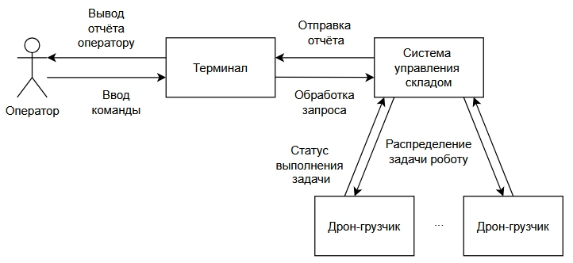
#### Сценарий работы
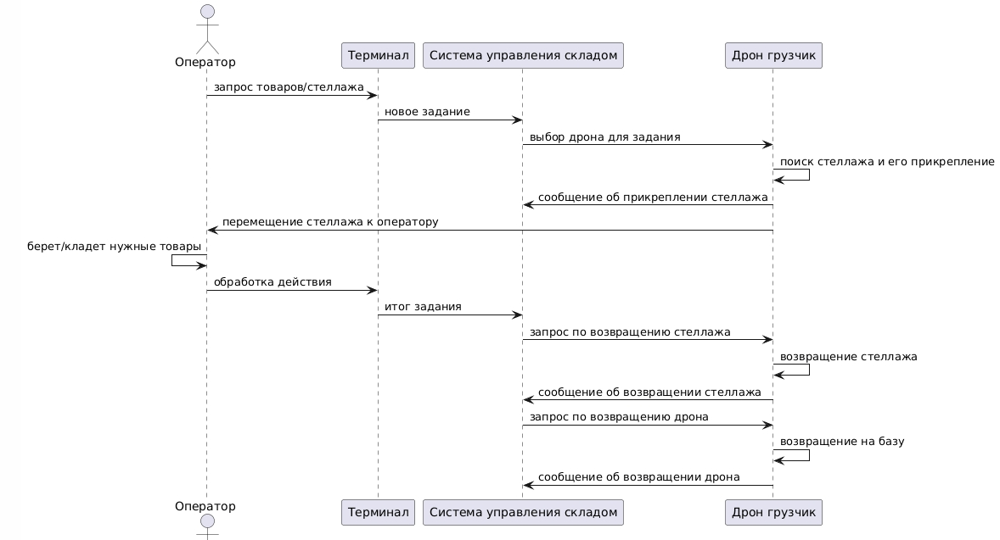
### Компоненты
#### Базовая архитектура
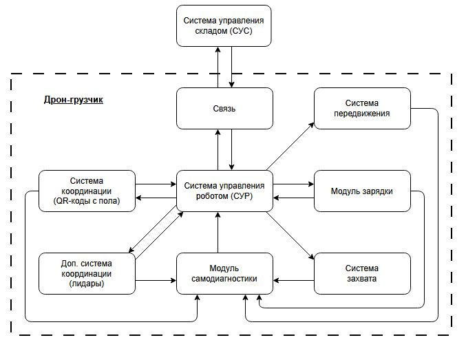
#### Описание компонентов
Название | Назначение
--- | ---
1\. Связь | Отвечает за обмен данными с центральной системой управления складом. Принимает команды (например, «привезти стеллаж X»), отправляет статусы о выполнении, уровне заряда и любых нештатных ситуациях.
2\. Система управления роботом | Получает задачи от модуля связи, интерпретирует их и координирует работу всех исполнительных подсистем. Принимает решения на основе данных от систем координации и диагностики, управляет движением, захватом и зарядкой.
3\. Модуль заряда | Отвечает за автоматическое определение момента, когда роботу требуется подзарядка. Управляет наведением на зарядную станцию, стыковкой и процессом зарядки. Передаёт статус зарядки в систему управления роботом.
4\. Система захвата | Управляет механизмом подъёма и фиксации стеллажа. Отвечает за точное позиционирование под стеллажом, корректный захват, подъём и удержание груза во время транспортировки.
5\. Система координации (QR-коды с пола) | Основная навигационная подсистема. Считывает QR-коды, нанесённые на полу склада, для определения точного местоположения робота. Позволяет следовать по заданному маршруту с высокой точностью и подтверждать прибытие в нужную точку (стеллаж, станция, зарядка).
6\. Доп. система координации (Лидары) | Вспомогательная навигационная подсистема. Использует боковые датчики (лидары) для контроля расстояния до стеллажей и стен. Обеспечивает безопасное движение в узких проходах и точную корректировку положения при подъезде к стеллажу или станции.
7\. Система передвижения | Преобразует команды от системы управления роботом в сигналы для моторов колёс. Отвечает за плавный старт и остановку, соблюдение скоростного режима, повороты и торможение. Взаимодействует с системами координации для точного следования маршруту.
8\. Cистема управления складом (WMS) | Внешняя система верхнего уровня, которая управляет всем складом в целом: ведёт учёт товаров, формирует заказы, отслеживает местоположение всех стеллажей и грузов, координирует работу нескольких роботов одновременно.
9\. Cистема самодиагностики | Осуществляет непрерывный мониторинг состояния всех подсистем: уровень заряда батареи, исправность датчиков (лазерных дальномеров, камер QR-кодов, датчиков захвата), состояние моторов. При обнаружении любой неисправности немедленно сообщает в систему управления роботом.
# Описание негативных сценариев (дрон-грузчик умного склада)

## Нарушение ЦБ (целей безопасности) в базовом решении

### Напоминание ЦБ

1. При любых обстоятельствах груз должен находиться в авторизованной секции (ЦБ-1)
2. Только авторизированные пользователи имеют доступ к системе (ЦБ-2)
3. При любых ситуациях робот должен выполнять только авторизированные команды (ЦБ-3)
4. При любых ситуациях робот должен держать безопасную дистанцию 10 см (ЦБ-4)
5. При любых обстоятельствах робот должен выстраивать корректный маршрут (ЦБ-5)
6. При любых обстоятельствах робот должен взаимодействовать только с заданным ему стеллажом (ЦБ-6)
7. При любых обстоятельствах груз не должен пострадать во время транспортировки (ЦБ-7)

### Таблица: атакованный компонент и нарушаемые ЦБ

| Атакованный компонент | ЦБ-1 | ЦБ-2 | ЦБ-3 | ЦБ-4 | ЦБ-5 | ЦБ-6 | ЦБ-7 | Кол-во нарушений |
|:---------------------|:----:|:----:|:----:|:----:|:----:|:----:|:----:|:----------------:|
| 1. Связь | 🔴 | 🔴 | 🔴 | 🟢 | 🟢 | 🔴 | 🔴 | 7/7 |
| 2. Система управления роботом | 🔴 | 🟢 | 🔴 | 🔴 | 🔴 | 🟢 | 🔴 | 5/7 |
| 3. Модуль заряда | 🔴 | 🟢 | 🟢 | 🔴 | 🔴 | 🟢 | 🟢 | 3/7 |
| 4. Система захвата | 🔴 | 🟢 | 🔴 | 🟢 | 🟢 | 🔴 | 🔴 | 4/7 |
| 5. Система координации (QR-коды) | 🔴 | 🟢 | 🔴 | 🔴 | 🔴 | 🟢 | 🟢 | 4/7 |
| 6. Доп. система координации (Лидары) | 🟢 | 🟢 | 🟢 | 🔴 | 🔴 | 🟢 | 🟢 | 2/7 |
| 7. Система передвижения | 🟢 | 🟢 | 🔴 | 🔴 | 🔴 | 🟢 | 🟢 | 3/7 |
| 8. WMS (внешняя) | 🔴 | 🟢 | 🔴 | 🔴 | 🔴 | 🔴 | 🟢 | 5/7 |
| 9. Система самодиагностики | 🔴 | 🟢 | 🟢 | 🔴 | 🟢 | 🟢 | 🟢 | 2/7 |

🟢 — ЦБ не нарушена  
🔴 — ЦБ нарушена

### Таблица негативных сценариев

| Название сценария | Описание |
|-------------------|----------|
| НС-1 | Доп. система координации (Лидары) не распознала сотрудника в проходе — робот продолжил движение и столкнулся с человеком. Нарушает ЦБ-4. |
| НС-2 | Система координации (QR-коды) считала QR-код с ошибкой — робот подъехал к неверной точке на станции комплектации и столкнулся с оператором. Нарушает ЦБ-4, ЦБ-5. |
| НС-3 | WMS выдал конфликтующие маршруты двум роботам — лобовое столкновение в узком проходе. Радары не засекли робота, движущегося навстречу Нарушает ЦБ-4, ЦБ-5. |
| НС-4 | Доп. система координации (Лидары) вышла из строя, самодиагностика не обнаружила неисправность — робот наехал на препятствие. Нарушает ЦБ-4, ЦБ-5. |
| НС-5 | Система захвата ошибочно подтвердила фиксацию стеллажа (неисправность датчиков) — стеллаж упал во время транспортировки. Нарушает ЦБ-1, ЦБ-7. |
| НС-6 | В результате столкновения (НС-3, НС-4 и др.) стеллаж выпал из захвата и упал. Нарушает ЦБ-1, ЦБ-4, ЦБ-7. |
| НС-7 | Связь или WMS передала неверные координаты стеллажа — робот привёз не тот стеллаж на станцию. Нарушает ЦБ-3, ЦБ-6, ЦБ-7. |
| НС-8 | WMS выдала неверную подсказку оператору о ячейке — оператор положил товар не в тот стеллаж. Нарушает ЦБ-1. |
| НС-9 | WMS не учёл пересечения маршрутов — образовался затор роботов, стеллаж не доставлен вовремя. Нарушает ЦБ-4, ЦБ-5. |
| НС-10 | Связь с WMS прервалась — робот остановился в проходе, блокируя движение. Нарушает ЦБ-1, ЦБ-4, ЦБ-5. |
| НС-11 | Система координации или связь выдала неверный маршрут — робот с грузом выехал за пределы авторизованной зоны. Нарушает ЦБ-1, ЦБ-3, ЦБ-5. |
| НС-12 | Канал связи скомпрометирован — злоумышленник отправил вредоносную команду, робот выполнил неавторизованное действие. Нарушает ЦБ-2, ЦБ-3, ЦБ-1, ЦБ-4, ЦБ-5, ЦБ-6, ЦБ-7. |
| НС-13 | Модуль заряда или самодиагностика неправильно оценила заряд — робот аварийно остановился с грузом в проходе. Нарушает ЦБ-1, ЦБ-4, ЦБ-5. |
| НС-14 | Несанкционированный физический доступ к роботу — через локальный интерфейс выполнено вмешательство в работу. Нарушает ЦБ-2, ЦБ-3, ЦБ-1, ЦБ-4, ЦБ-5, ЦБ-6, ЦБ-7. |
| НС-15 | Система захвата отказала во время перевозки и стеллаж упал. Нарушает ЦБ-1, ЦБ-3, ЦБ-6, ЦБ-7. |

---

## Детальное описание сценариев

### НС-1: Столкновение робота с сотрудником в проходе

**Атакованный компонент:** 6. Доп. система координации (Лидары)

**Описание:** Робот везёт стеллаж по маршруту. Сотрудник вышел в проход для проверки товара. Лидары не распознали человека (блики, нестандартная поза, угол обзора) или система выдала устаревшие данные. Система управления считает путь свободным и не инициирует торможение. Робот сталкивается с сотрудником.

**Затрагиваемая ценность:** Безопасность человека (критический ущерб)

**Нарушаемые цели безопасности:** ЦБ-4

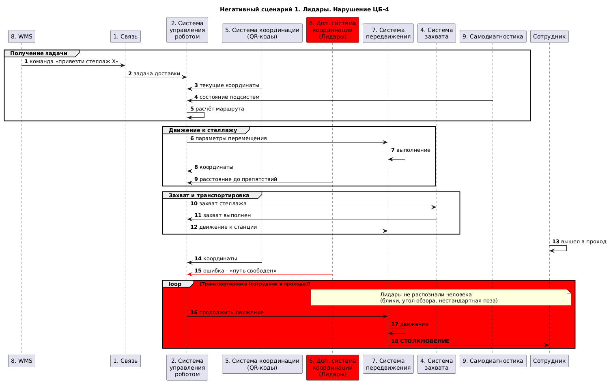

---

### НС-2: Столкновение на станции комплектации

**Атакованный компонент:** 5. Система координации (QR-коды)

**Описание:** Робот привозит стеллаж к станции. QR-код считан с ошибкой или робот подъехал к неверной точке. Робот движется в сторону оператора вместо штатной зоны выгрузки. Происходит столкновение.

**Затрагиваемая ценность:** Безопасность человека (критический ущерб)

**Нарушаемые цели безопасности:** ЦБ-4, ЦБ-5

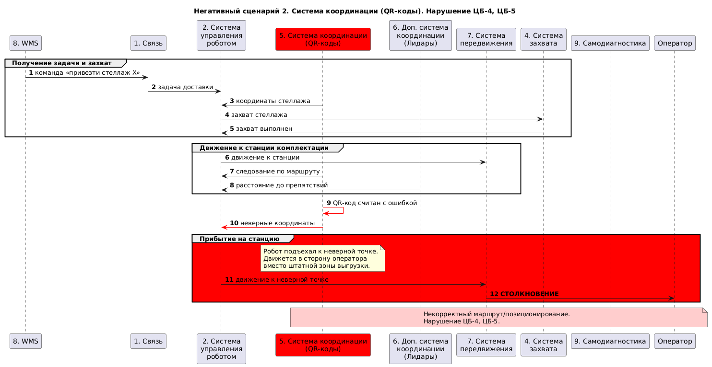

---

### НС-3: Лобовое столкновение двух роботов

**Атакованный компонент:** 8. WMS. 6. Лидары

**Описание:** WMS выдал конфликтующие маршруты двум роботам. Оба считают путь свободным и продолжают движение. Происходит лобовое столкновение.

**Затрагиваемая ценность:** Сохранность робота (высокий ущерб)

**Нарушаемые цели безопасности:** ЦБ-4, ЦБ-5

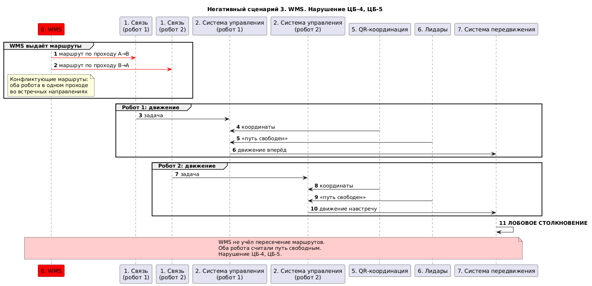

---

### НС-4: Столкновение робота с объектом инфраструктуры

**Атакованный компонент:** 6. Доп. система координации (Лидары), 9. Система самодиагностики

**Описание:** Лидар вышел из строя, самодиагностика не обнаружила неисправность. Робот полагается только на QR-навигацию. Из-за дрейфа наезжает на препятствие (поддоны, тележка).

**Затрагиваемая ценность:** Сохранность робота (высокий ущерб)

**Нарушаемые цели безопасности:** ЦБ-4, ЦБ-5

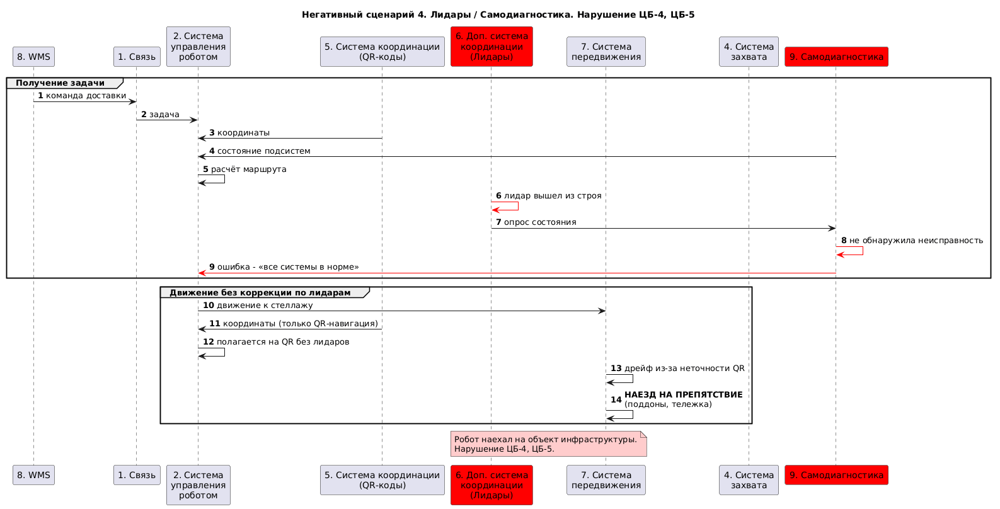

---

### НС-5: Падение стеллажа из-за ошибки захвата

**Атакованный компонент:** 4. Система захвата

**Описание:** Датчики захвата передают некорректные показания. Система ошибочно считает стеллаж зафиксированным. Робот поднимает и везёт. Стеллаж соскальзывает и падает.

**Затрагиваемая ценность:** Целостность инфраструктуры, сохранность груза (высокий ущерб)

**Нарушаемые цели безопасности:** ЦБ-1, ЦБ-7

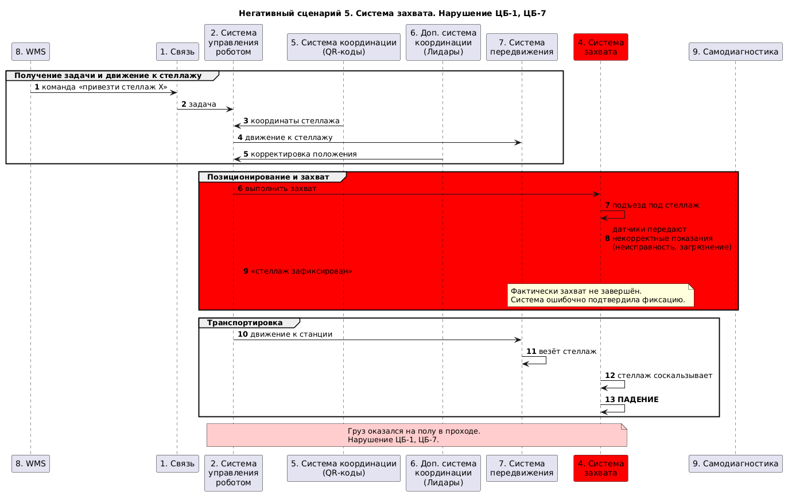

---

### НС-6: Падение стеллажа при столкновении

**Атакованный компонент:** Несколько (см. НС-3, НС-4)

**Описание:** В результате столкновения удар или инерция нарушают фиксацию захвата. Стеллаж выпадает и падает.

**Затрагиваемая ценность:** Целостность инфраструктуры, сохранность груза (высокий ущерб)

**Нарушаемые цели безопасности:** ЦБ-1, ЦБ-4, ЦБ-7

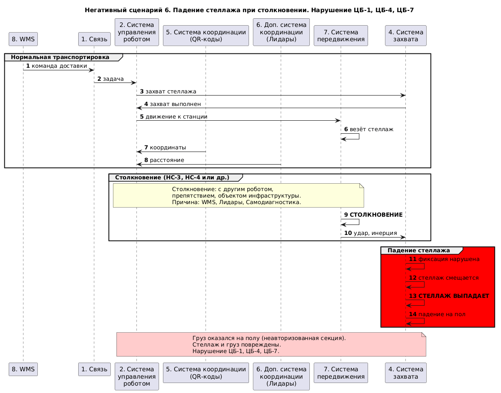

---

### НС-7: Доставка не того стеллажа

**Атакованный компонент:** 1. Связь, 8. WMS

**Описание:** Из-за сбоя в WMS или искажения при передаче робот получает неверные координаты. Поднимает и привозит не тот стеллаж. Груз может быть повреждён или потерян при неверной обработке.

**Затрагиваемая ценность:** Сохранность груза (высокий ущерб)

**Нарушаемые цели безопасности:** ЦБ-3, ЦБ-6, ЦБ-7

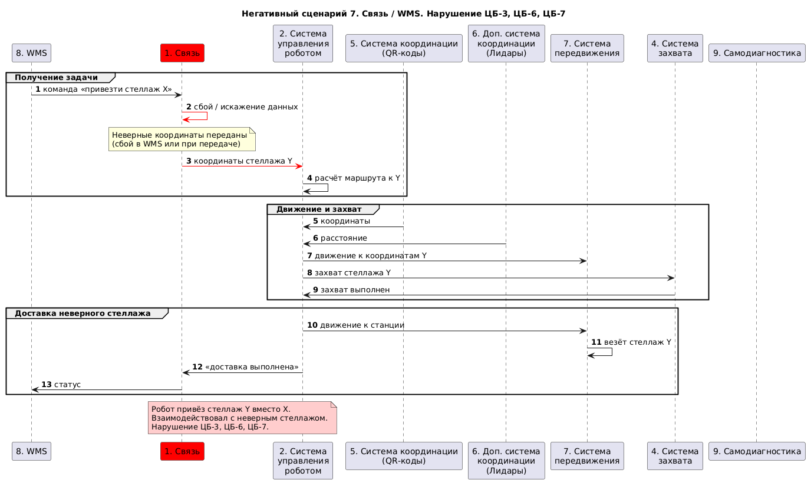

---

### НС-8: Неверная подсказка оператору

**Атакованный компонент:** 8. WMS

**Описание:** WMS показывает неверную ячейку из-за сбоя или рассинхронизации. Оператор кладёт товар не в тот стеллаж. Учёт нарушается.

**Затрагиваемая ценность:** Сохранность груза (высокий ущерб)

**Нарушаемые цели безопасности:** ЦБ-1

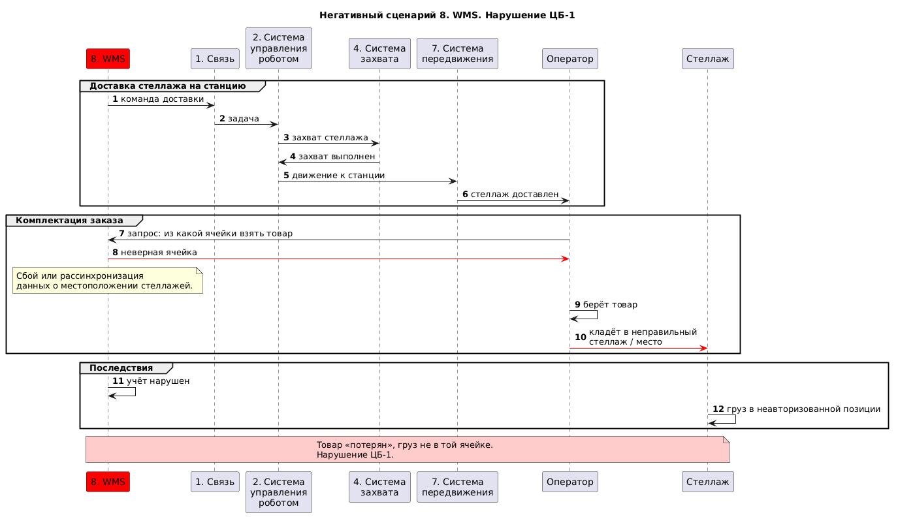

---

### НС-9: Затор роботов из-за конфликта маршрутов

**Атакованный компонент:** 8. WMS

**Описание:** WMS не учёл пересечения траекторий. Роботы останавливаются друг перед другом. Образуется затор. Стеллаж не доставлен вовремя.

**Затрагиваемая ценность:** Непрерывность работы (средний ущерб)

**Нарушаемые цели безопасности:** ЦБ-4, ЦБ-5

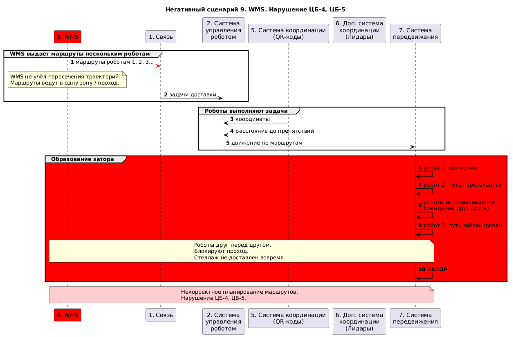

---

### НС-10: Сбой связи — «зависание» робота в проходе

**Атакованный компонент:** 1. Связь

**Описание:** Связь с WMS прерывается. Робот останавливается в проходе. Блокирует движение других роботов. Образуется затор. Маршрут привёл к блокирующей позиции.

**Затрагиваемая ценность:** Непрерывность работы (средний ущерб)

**Нарушаемые цели безопасности:** ЦБ-1, ЦБ-4, ЦБ-5

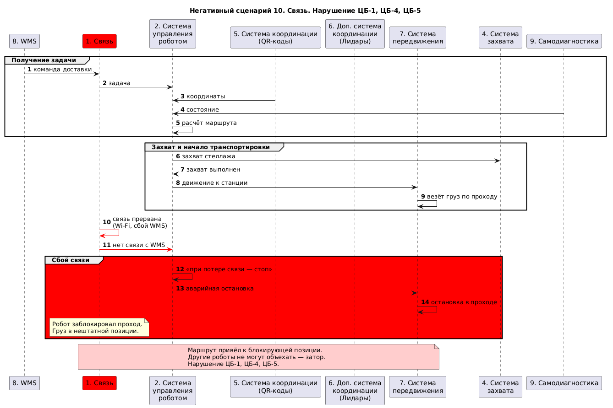

---

### НС-11: Груз вывозится за пределы авторизованной зоны

**Атакованный компонент:** 1. Связь или 5. Система координации

**Описание:** Ошибка в карте маршрутов, сбой навигации или вредоносная команда. Робот с грузом выезжает за пределы зоны склада.

**Затрагиваемая ценность:** Сохранность груза, целостность инфраструктуры (высокий ущерб)

**Нарушаемые цели безопасности:** ЦБ-1, ЦБ-3, ЦБ-5

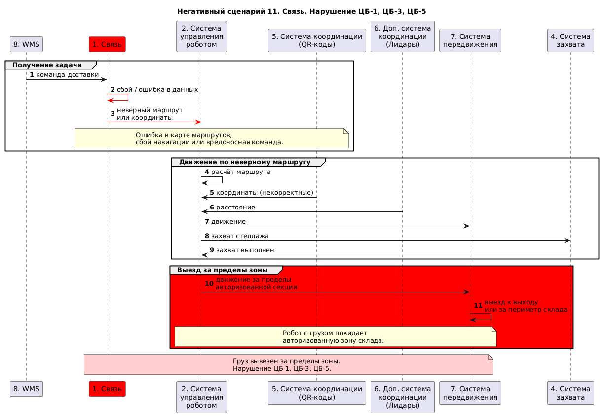

---

### НС-12: Выполнение неавторизованной команды (атака на канал связи)

**Атакованный компонент:** 1. Связь

**Описание:** Канал связи недостаточно защищён. Злоумышленник перехватывает или подменяет трафик. Робот выполняет вредоносную команду (изменение маршрута, сброс стеллажа, движение в опасную зону, взаимодействие с чужим стеллажом).

**Затрагиваемая ценность:** Безопасность человека, сохранность робота, целостность инфраструктуры, сохранность груза

**Нарушаемые цели безопасности:** ЦБ-2, ЦБ-3, ЦБ-1, ЦБ-4, ЦБ-5, ЦБ-6, ЦБ-7

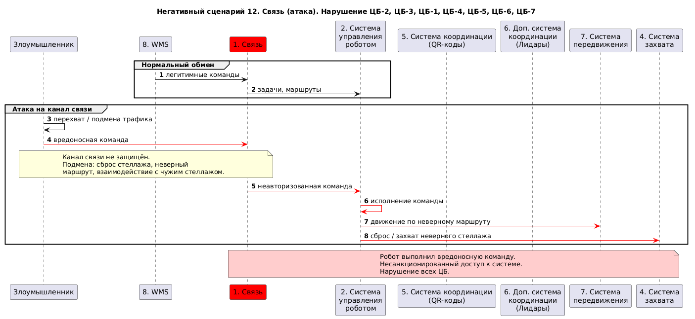

---

### НС-13: Аварийная остановка с грузом из-за разряда батареи

**Атакованный компонент:** 3. Модуль заряда, 9. Система самодиагностики

**Описание:** Модуль заряда или самодиагностика неправильно оценила остаток заряда. Батарея разряжается критически. Робот аварийно останавливается с грузом в проходе. Образуется затор. Маршрут не предусматривал резерв для аварийной остановки.

**Затрагиваемая ценность:** Непрерывность работы (средний ущерб)

**Нарушаемые цели безопасности:** ЦБ-1, ЦБ-4, ЦБ-5

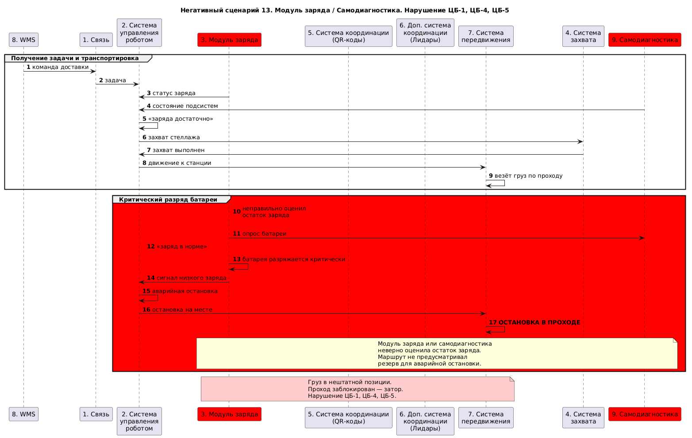

---

### НС-14: Несанкционированный физический доступ к роботу

**Атакованный компонент:** Робот в целом (локальный доступ)

**Описание:** Злоумышленник получает физический доступ. Через локальный интерфейс, порт отладки или снятие панели выполняется вмешательство: изменение конфигурации, загрузка вредоносного ПО, принудительный запуск движения, команда на взаимодействие с чужим стеллажом или сброс груза.

**Затрагиваемая ценность:** Безопасность человека, сохранность робота, сохранность груза

**Нарушаемые цели безопасности:** ЦБ-2, ЦБ-3, ЦБ-1, ЦБ-4, ЦБ-5, ЦБ-6, ЦБ-7

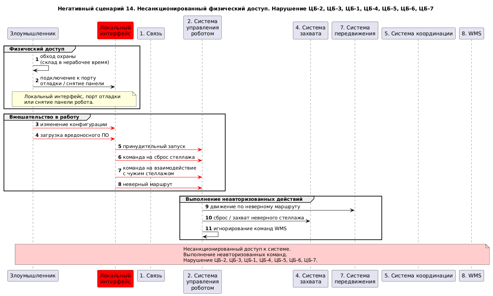

---

### НС-15: Ложное срабатывание датчика потери захвата

**Атакованный компонент:** 4. Система захвата

**Описание:** Система захвата отказывает. Робот освобождает захват в проходе. Стеллаж падает. Робот преждевременно прекратил взаимодействие с заданным стеллажом.

**Затрагиваемая ценность:** Целостность инфраструктуры, сохранность груза (высокий ущерб)

**Нарушаемые цели безопасности:** ЦБ-1, ЦБ-3, ЦБ-6, ЦБ-7

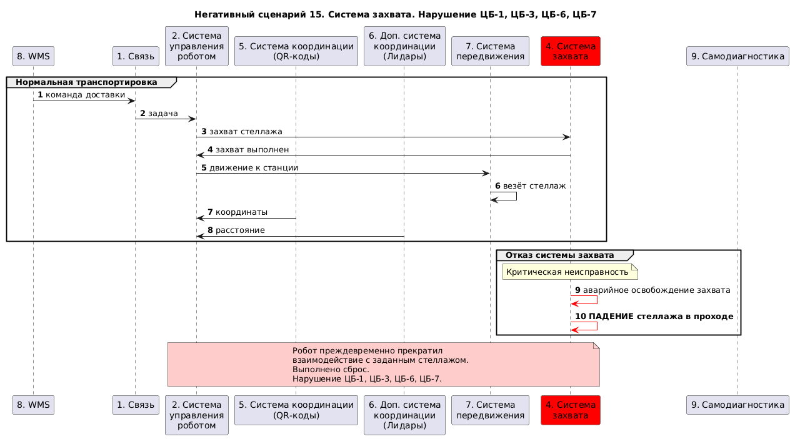

---

## Сводная таблица: сценарии и нарушаемые цели безопасности

| Сценарий | ЦБ-1 | ЦБ-2 | ЦБ-3 | ЦБ-4 | ЦБ-5 | ЦБ-6 | ЦБ-7 |
|----------|:----:|:----:|:----:|:----:|:----:|:----:|:----:|
| НС-1 | — | — | — | ✓ | — | — | — |
| НС-2 | — | — | — | ✓ | ✓ | — | — |
| НС-3 | — | — | — | ✓ | ✓ | — | — |
| НС-4 | — | — | — | ✓ | ✓ | — | — |
| НС-5 | ✓ | — | — | — | — | — | ✓ |
| НС-6 | ✓ | — | — | ✓ | — | — | ✓ |
| НС-7 | — | — | ✓ | — | — | ✓ | ✓ |
| НС-8 | ✓ | — | — | — | — | — | — |
| НС-9 | — | — | — | ✓ | ✓ | — | — |
| НС-10 | ✓ | — | — | ✓ | ✓ | — | — |
| НС-11 | ✓ | — | ✓ | — | ✓ | — | — |
| НС-12 | ✓ | ✓ | ✓ | ✓ | ✓ | ✓ | ✓ |
| НС-13 | ✓ | — | — | ✓ | ✓ | — | — |
| НС-14 | ✓ | ✓ | ✓ | ✓ | ✓ | ✓ | ✓ |
| НС-15 | ✓ | — | ✓ | — | — | ✓ | ✓ |

## Переработанная архитектура

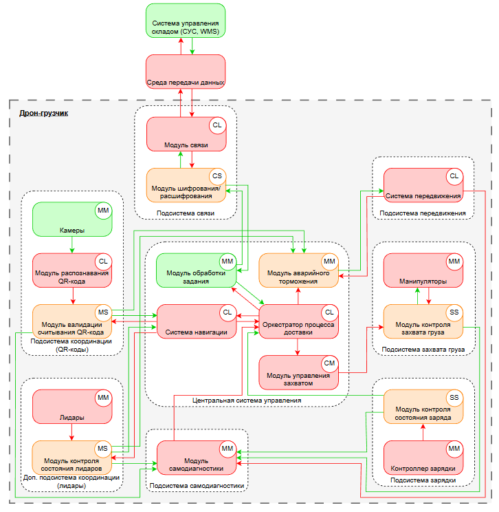

### Таблица компонентов переработанной архитектуры

| Компонент | Описание |
| --- | --- | 
| 1. Модуль связи | Отвечает за обмен данными с центральной системой управления складом. Принимает команды (например, «привезти стеллаж X»), отправляет статусы о выполнении, уровне заряда и любых нештатных ситуациях. |
| 2. Модуль шифрования/расшифрования | Отвечает за шифрование и расшифрование данных от модуля связи и данных от центральной системы управления дроном. |
| 3. Модуль обработки задания |  Отвечает за обработку данных о задании и передачи его состояния между подсистемой связи и центральной системой управления дрона (между СУС и ЦСУ). |
| 4. Оркестратор процесса доставки | Главный компонент центральной системы управления дроном. Отвечает за весь процесс выполнения задания. Координирует работу всех исполнительных подсистем. Принимает решение на основе данных от системы навигации, модулей самодиагностики и контроля состояния заряда. |
| 5. Система навигации | Отвечает за обработку данных между подсистемами координации (лидары и QR-коды) и центральной системой управления дроном. Данные от валидирующих подмодулей отправляются в оркестратор процесса доставки для дальнейшего принятия действий. (А еще данные идут от оркестратора до этих самых модулей, чтобы им было с чем сравнивать). |
| 6. Модуль управления захватом | Отвечает за выполнение захвата груза. После получения команды от оркестратора процесса доставки передает задание в соответствующую подсистему. |
| 7. Модуль аварийного торможения | Отвечает за подачу команды перемещения или эстренное аварийное торможение дрона при соответствующем запросе оркестратора процесса доставки. |
| 8. Камеры | Отвечают за создание фото, которые далее будут проанализированны модулем распознания QR-кодов. |
| 9. Модуль распознавания QR-кода | Отвечает за анализ данных от камеры и определение точного положения робота через обнаруженные QR-коды. Результаты отправляет в модуль валидации. |
| 10. Модуль валидации считывания QR-кода | Отвечает за проверку координат от модуля распознания и системы навигации, чтобы не было несостыковок. |
| 11. Лидары | Вспомогательная навигационная подсистема. Использует боковые датчики (лидары) для контроля расстояния до стеллажей и стен. Обеспечивает безопасное движение в узких проходах и точную корректировку положения при подъезде к стеллажу или станции. |
| 12. Модуль контроля состояния лидаров | Отвечает за проверку корректности работы лидаров. |
| 13. Система передвижения | Отвечает за работу колес дрона при соотвтествующей команде от центральной системы управления дроном. |
| 14. Манипуляторы | Отвечает за захват стеллажа или его опускание при соответсвующей команде от модуля контроля захвата груза. |
| 15. Модуль контроля захвата груза | Управляет механизмом подъёма и фиксации стеллажа. Отвечаетза точное позиционирование под стеллажом, корректный захват, подъём и удержание груза во время транспортировки. |
| 16. Контроллер зарядки | Управляет процессом стыковки к подзарядной станции, а также за само состояние батареи. Данные передает в модуль контроля состояния заряда. |
| 17. Модуль контроля состояния заряда | Отвечает за валидацию состояния батареи. Проверяет чтобы не было больших скачков в процентах заряда за небольшой промежуток времени, а также определение момента, когда роботу требуется на базу для подзарядки. |
| 18. Модуль самодиагностики | Отвечает за сбор всех данных от валидирующих модулей и передачу их в центральную систему управления дроном. |

## Функциональный сценарий

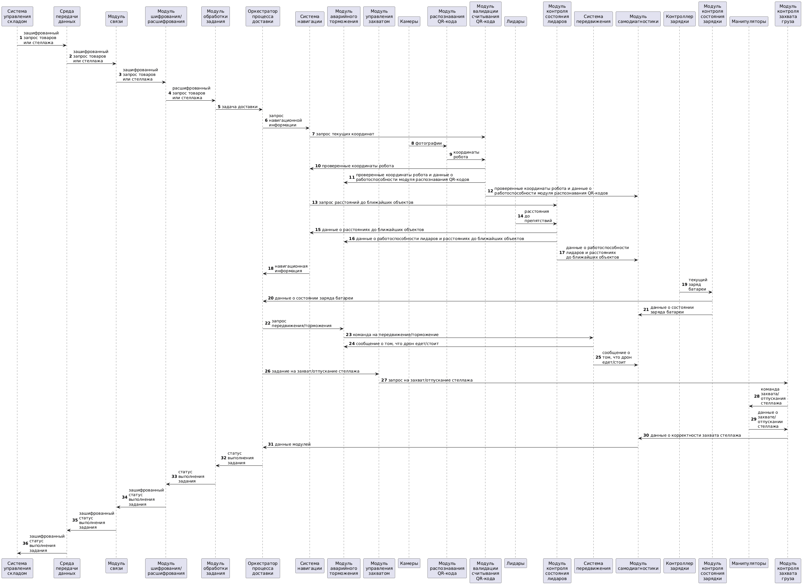

### Таблица доверенных компонентов

| Компонент | Уровень доверия | Обоснование |
| --- | --- | --- |
| 1. Модуль связи | $\textcolor{red}{\textsf{Недоверенный}}$ |  |
| 2. Модуль шифрования/расшифрования | $\textcolor{orange}{\textsf{Доверенный}}$ | Соблюдение ЦБ 2, 3 |
| 3. Модуль обработки задания | $\textcolor{green}{\textsf{Доверенный}}$ | Соблюдение ЦБ 5, 6 |
| 4. Оркестратор процесса доставки | $\textcolor{red}{\textsf{Недоверенный}}$ |  |
| 5. Система навигации | $\textcolor{red}{\textsf{Недоверенный}}$ |  |
| 6. Модуль управления захватом | $\textcolor{red}{\textsf{Недоверенный}}$ |  |
| 7. Модуль аварийного торможения | $\textcolor{orange}{\textsf{Доверенный}}$ | Соблюдение ЦБ 1, 4, 7 |
| 8. Камеры | $\textcolor{green}{\textsf{Доверенный}}$ | Соблюдение ЦБ 1 |
| 9. Модуль распознавания QR-кода | $\textcolor{red}{\textsf{Недоверенный}}$ |  |
| 10. Модуль валидации считывания QR-кода | $\textcolor{orange}{\textsf{Доверенный}}$ | Соблюдение ЦБ 1|
| 11. Лидары | $\textcolor{red}{\textsf{Недоверенный}}$ | Соблюдение ЦБ 4, 7 |
| 12. Модуль контроля состояния лидаров | $\textcolor{orange}{\textsf{Доверенный}}$ | Соблюдение ЦБ 4 |
| 13. Система передвижения | $\textcolor{red}{\textsf{Недоверенный}}$ |  |
| 14. Манипуляторы | $\textcolor{red}{\textsf{Недоверенный}}$ |  |
| 15. Модуль контроля захвата груза | $\textcolor{orange}{\textsf{Доверенный}}$ | Соблюдение ЦБ 7 |
| 16. Контроллер зарядки | $\textcolor{red}{\textsf{Недоверенный}}$ |  |
| 17. Модуль контроля состояния заряда | $\textcolor{orange}{\textsf{Доверенный}}$ |  |
| 18. Модуль самодиагностики | $\textcolor{red}{\textsf{Недоверенный}}$ |  |

### Качественная оценка доменов

| Компонент | Уровень доверия | Оценка | Кол-во входящих интерфейсов |
| --- | --- | --- | --- |
| 1. Модуль связи | $\textcolor{red}{\textsf{Недоверенный}}$ | CL | 2 |
| 2. Модуль шифрования/расшифрования | $\textcolor{orange}{\textsf{Доверенный}}$ | CS | 2 |
| 3. Модуль обработки задания | $\textcolor{green}{\textsf{Доверенный}}$ | MM | 2 |
| 4. Оркестратор процесса доставки | $\textcolor{red}{\textsf{Недоверенный}}$ | CL | 4 |
| 5. Система навигации | $\textcolor{red}{\textsf{Недоверенный}}$ | CL | 3 |
| 6. Модуль управления захватом | $\textcolor{red}{\textsf{Недоверенный}}$ | CM | 1 |
| 7. Модуль аварийного торможения | $\textcolor{orange}{\textsf{Доверенный}}$ | MM | 4 |
| 8. Камеры | $\textcolor{green}{\textsf{Доверенный}}$ | MM | 0 |
| 9. Модуль распознавания QR-кода | $\textcolor{red}{\textsf{Недоверенный}}$ | CL | 1 |
| 10. Модуль валидации считывания QR-кода | $\textcolor{orange}{\textsf{Доверенный}}$ | MS | 2 |
| 11. Лидары | $\textcolor{red}{\textsf{Недоверенный}}$ | MM | 0 |
| 12. Модуль контроля состояния лидаров | $\textcolor{orange}{\textsf{Доверенный}}$ | MS | 2 |
| 13. Система передвижения | $\textcolor{red}{\textsf{Недоверенный}}$ | CL | 1 |
| 14. Манипуляторы | $\textcolor{red}{\textsf{Недоверенный}}$ | MM | 1 |
| 15. Модуль контроля захвата груза | $\textcolor{orange}{\textsf{Доверенный}}$ | SS | 2 |
| 16. Контроллер зарядки | $\textcolor{red}{\textsf{Недоверенный}}$ | MM | 0 |
| 17. Модуль контроля состояния заряда | $\textcolor{orange}{\textsf{Доверенный}}$ | SS | 1 |
| 18. Модуль самодиагностики | $\textcolor{red}{\textsf{Недоверенный}}$ | MM | 5 |

## Проверка негативных сценариев
| Название сценария | Описание |
| --- | --- |
|НС-1| Лидары сломались, и в течение длительного времени передают постоянные координаты. Однако модуль контроля состояния лидаров определил неисправность и передал соответствующую информацию модулю аварийного торможения. На основании полученной информации модуль аварийного торможения отдал команду остановки робота для предотвращения возможных столкновений, ЦБ не нарушаются.|
|НС-2| Модуль считывания QR-кода был скомпрометирован, и передаёт константные значения в течение длительного времени. Однако модуль валидации QR-кодов определил неисправность модуля и передал соответствующую информацию модулю аварийного торможения. На основании полученной информации модуль аварийного торможения отдал команду остановки робота для предотвращения возможных столкновений, ЦБ не нарушаются.|
|НС-3| Система управления складом выдала конфликтующие маршруты, а лидары вышли из строя и в течение длительного времени передаёт постоянные координаты. Однако модуль контроля состояния лидаров определил неисправность и передал соответствующую информацию модулю аварийного торможения. На основании полученной информации модуль аварийного торможения отдал команду остановки робота, ЦБ не нарушаются.|
|НС-4| Лидары сломались, и в течение длительного времени передают постоянные координаты. Однако модуль контроля состояния лидаров определил неисправность и передал соответствующую информацию модулю аварийного торможения. На основании полученной информации модуль аварийного торможения отдал команду остановки робота, ЦБ не нарушаются.|
### Проверка негативного сценария НС-4:

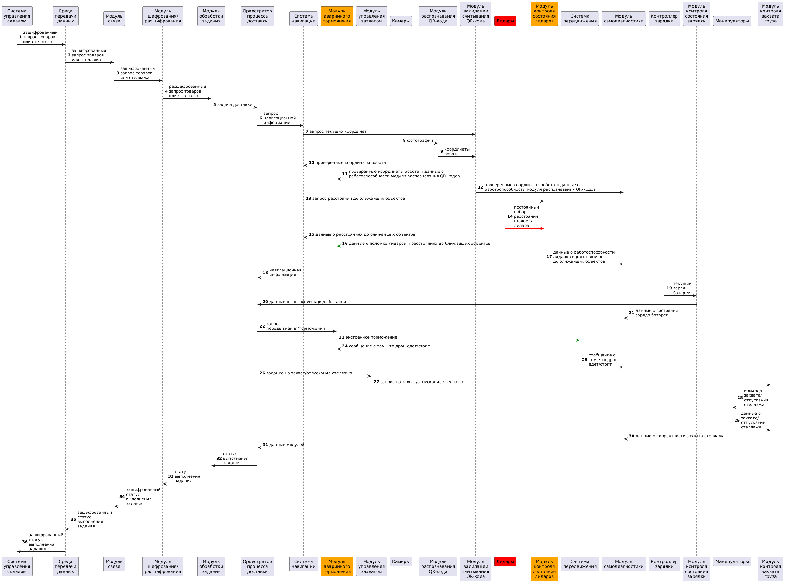

